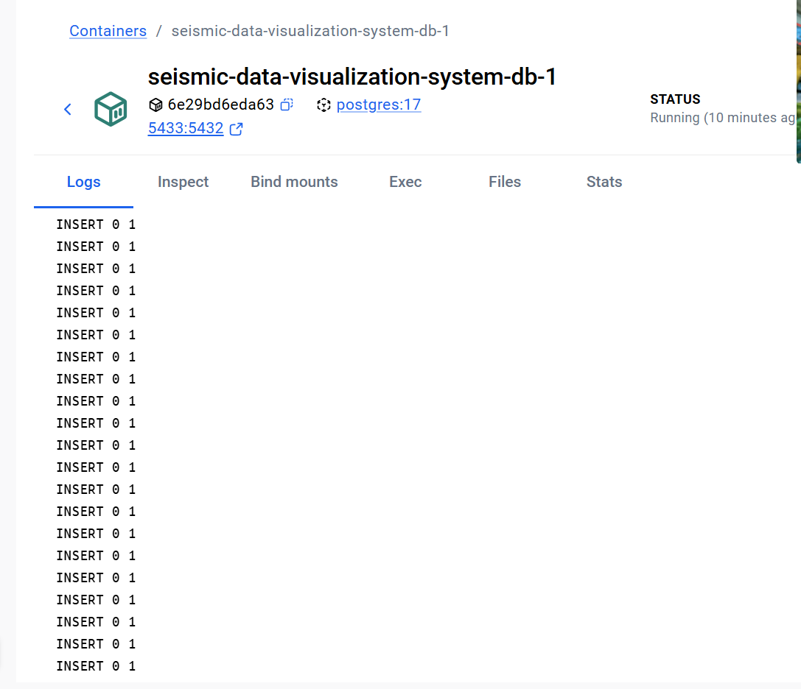
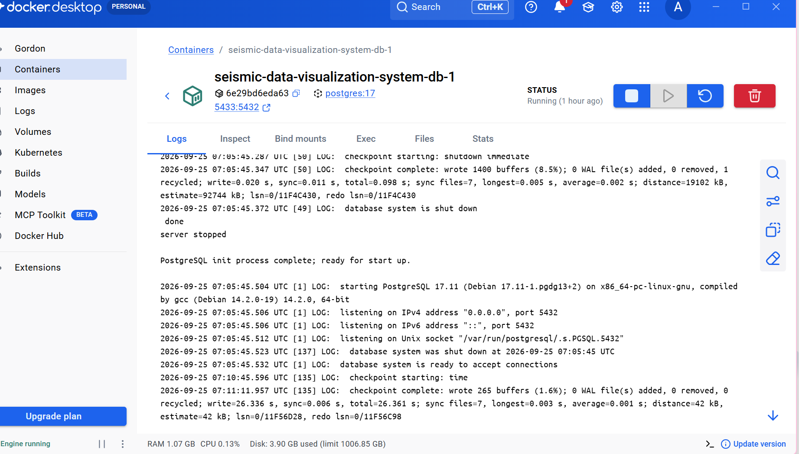
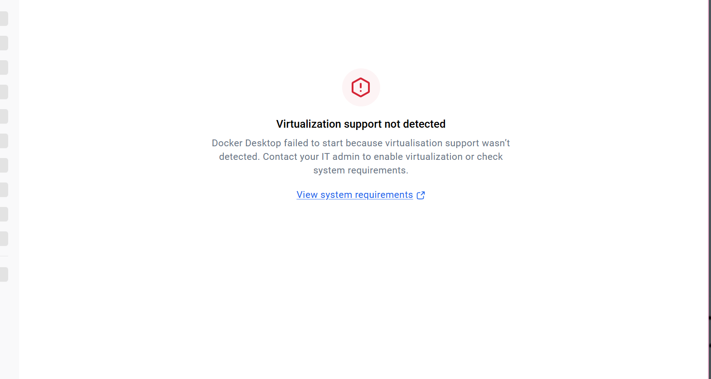
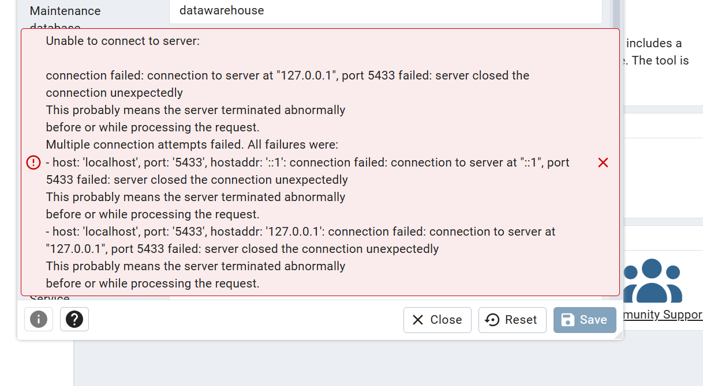
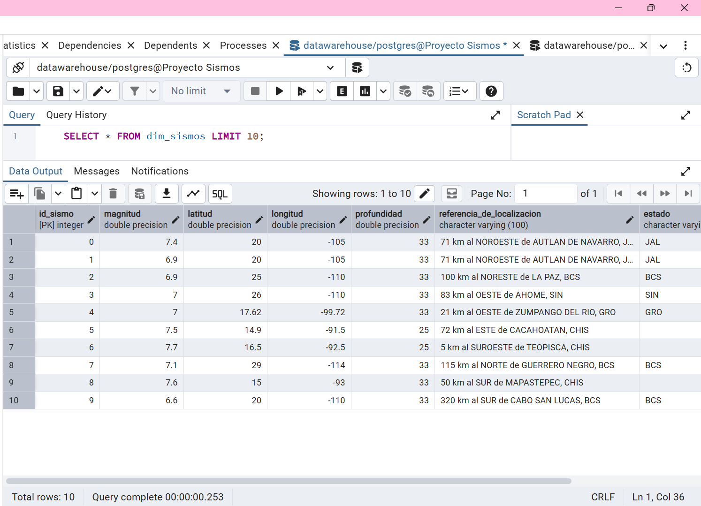

# Levantamiento del Proyecto - Sistema de Visualización de Datos Sísmicos 

## Requisitos 
* Docker Desktop y WSL 2 habilitado. 
* pgAdmin 4 (Cliente de PostgreSQL). 
* Git y terminal (PowerShell). 

## Pasos Exactos Ejecutados 

1. Creación de un fork del repositorio del equipo y clonación en el entorno local. 
2. Ejecución del comando `docker-compose up -d` desde la raíz del proyecto para levantar la infraestructura. 
3. Construcción del contenedor basado en la imagen `postgres:17` con el mapeo del puerto local 5433 al puerto interno 5432. 
4. Carga automática de los datos: Los scripts SQL ubicados en la carpeta `sql/` (00 al 05) se ejecutaron por sí solos gracias al mapeo del volumen hacia `/docker-entrypoint-initdb.d/`, creando las tablas y poblando los datos del SSN e INEGI. 
5. Configuración del servidor en pgAdmin apuntando a `localhost:5433` con las credenciales definidas en el archivo docker-compose (`datawarehouse`, usuario `postgres`, contraseña `postgres`). 
6. Ejecución de consulta SQL directamente en la base de datos para validar la importación de la información. 

## Errores Aparecidos y Soluciones 
*Error de conexión a la API de Docker:*
	 Al lanzar docker-compose, apareció el error 
	 `failed to connect to the docker API at npipe:////./pipe/dockerDesktopLinuxEngine`. 

	
*Solución:* El error ocurrió porque olvidé reiniciar el equipo después de instalar/actualizar WSL 2. Reinicié la computadora, abrí Docker Desktop para encender el motor y el comando funcionó correctamente. 

*Conexión rechazada en pgAdmin:* Al intentar guardar la conexión al puerto 5433 por primera vez, el servidor cerró la conexión inesperadamente (`server closed the connection unexpectedly`). 

*Solución:* Revisé los logs del contenedor en Docker Desktop y noté que la base de datos estaba bloqueada temporalmente realizando cientos de miles de inserciones (`INSERT 0 1`) correspondientes a los archivos pesados de sismos. Esperé sin interrumpir el proceso hasta que el log indicó `database system is ready to accept connections` y la conexión se guardó exitosamente. 

## Consulta Ejecutada 

Consulta de validación para comprobar la correcta carga de datos: 

> sql SELECT * FROM dim_sismos LIMIT 10;

